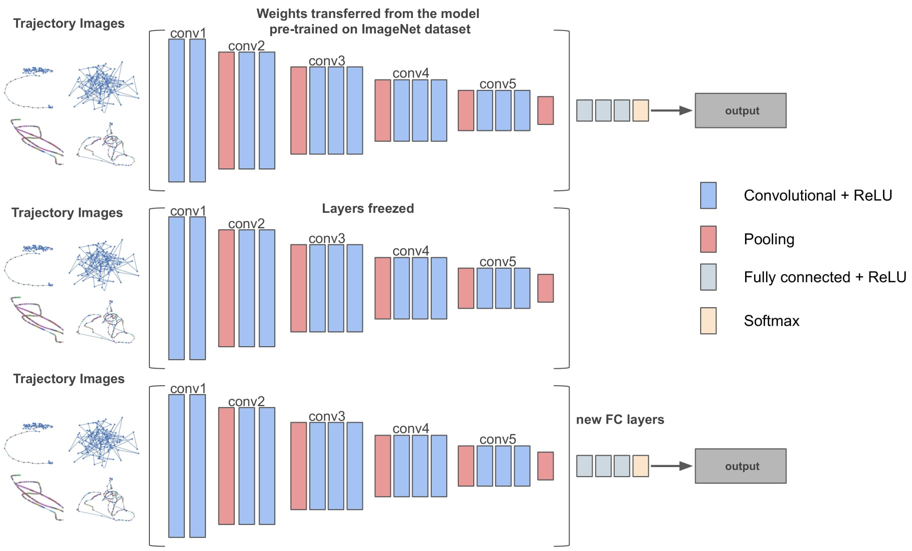

## d-LOOK (deep-Look)


<p align="center">
  
</p>

### What is d-LOOK

d-LOOK is an automated way to execute various supervised deep learning models including:
- VGG16
- VGG19
- MobileNetV2
- ResNet50
- ResNet50V2
- InceptionV3
- Xception
- InceptionResNetV2
- ResNet152V2
- DenseNet201
- NASNetLarge

See more about Keras Models: [Keras Applications](https://keras.io/api/applications/)

---

#### Fine-tuning 
d-LOOK is utilizing transfer learning and specifically fine-tuning. In fine-tuning, the fully connected layers of the pre-trained model are replaced with a new set of fully connected layers. These new layers are trained on a given data set, and the weights of the top layers of the pre-trained model along with the newly-added layers are “fine-tuned” by means of backpropagation. Thus, the weights are tuned from generic feature maps to features associated specifically with the provided data set.

Fine-tuning is a multi-step process:

1. Remove the fully connected nodes at the end of the network (i.e., where the actual class label predictions are made).
2. Replace the fully connected nodes with freshly initialized ones.
3. Freeze earlier convolutional layers earlier in the network (ensuring that any previous robust features learned by the CNN are not destroyed).
4. Start training, but only train the fully connected layer heads.
5. Optionally unfreeze some/all of the convolutional layers in the network and perform a second pass of training.


Below Figure is an example that illustrates the fine-tuning process on the VGG16 network.
The same process was applied to all provided deep learning models. The VGG16 model contains 13 convolutional and 3 fully connected layers.
The final set of layers that contained the fully connected layers along with the softmax activation function is called the “head”.
The network was instantiated with weights pre-trained on [ImageNet](https://www.image-net.org/) dataset, as shown at top of the figure. Afterwards, the fully connected layers were truncated, and the final pool layer was
treated as a feature extractor, as depicted in the middle of the figure. Finally, the truncated
layers were replaced by a new fully connected head layer, which was randomly initialized and placed
on top of the original architecture (bottom of the figure). Then, the model was trained
through a backpropagation process. The body of the network, i.e., the weights of the
convolutional layers of the pre-trained network, were frozen such that only the fully connected head layer
was trained. This was because the convolutional layers had already learned discriminative filters
and captured universal features like curves and edges; thus, these weights had to remain
intact. On the other hand, the fully connected head layer was randomly initialized from scratch and
focused on learning data set-specific features; thus, random values were able to destroy
the learned features.




---
#### Configuration File

In `parameters_config.json` file, several variables can be configured:

	"epochs": ,
	"batch_size": ,
	"test_size": ,
	"dropout_keep_prob": ,
	"number_of_classes":,
	"dl_network":"",
	"activation_function": "",
	"activation_function_output": "",
	"loss_function": "",
	"optimizer": "Adam"

`epochs`: an arbitrary cutoff, generally defined as "one pass over the entire dataset", used to separate training into distinct phases, which is useful for logging and periodic evaluation

`batch_size`: the number of training examples in one forward/backward pass. The higher the batch size, the more memory space you'll need

`test_size`: this parameter decides the size of the data that has to be split as the test dataset

`dropout_keep_prob`: the Dropout layer randomly sets input units to 0 with a frequency of rate at each step during training time, which helps prevent overfitting

`number_of_classes`: the number of classes

`dl_network`: the Keras model (VGG16, ResNet50, etc.)

`activation_function`: the activation function is responsible for transforming the summed weighted input from the node into the activation of the node or output for that input

`activation_function_output`: the activation function of the output layer

`loss_function`: the loss function, a scalar value that we attempt to minimize during our training of the model. 

`optimizer`: Optimizers are algorithms or methods used to change the attributes of the neural network such as weights and learning rate to reduce the losses

---

#### Example Usage


###### _General cmd_
```shell
python train.py --d [dataset_path] --m [modelname (.model)] --c [config file]
```

###### _A local example cmd_
```shell
Example:  python train.py --d /home/antonis/repos/d-LOOK/test_dataet/4hours/classes --m testmodel.model -c parameters_config.json
```


